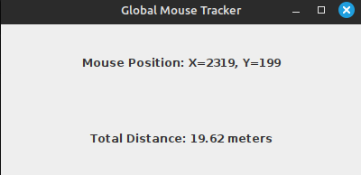

# MouseTrackerWithGUI

MouseTrackerWithGUI is a lightweight Java application that globally tracks mouse movements (outside the program window) and calculates the total distance traveled by the mouse in meters. The application features a clean graphical user interface to display live updates of the mouse's position and travel distance.

## Features
- **Global mouse movement tracking**: Monitors mouse movements across the entire screen.
- **Distance calculation**: Tracks the total distance traveled by the mouse in real-time (measured in meters).
- **Simple GUI**: Displays the mouse's position (X, Y coordinates) and the distance in an easy-to-read interface.

## Screenshot

## How It Works
- **Uses JNA (Java Native Access)** to interact with the X11 display server on Linux.
- Calculates movement using the screen's DPI (96 DPI assumed by default).
- Refreshes every 50 milliseconds for smooth real-time updates.

## Requirements
- Java 17 or later.
- A Linux environment with an X11 display server.
